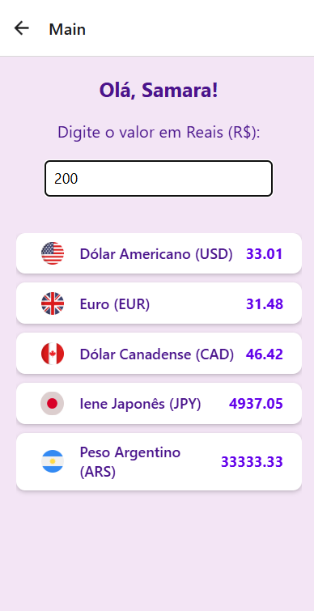

# Conversor de Moeda

Este é um aplicativo simples de conversão de moeda, desenvolvido utilizando React Native com Expo. O app permite que os usuários insiram um valor em Reais (BRL) e veja as conversões para várias moedas, incluindo Dólar Americano (USD), Euro (EUR), Dólar Canadense (CAD), Iene Japonês (JPY) e Peso Argentino (ARS). As taxas de câmbio são obtidas em tempo real da API `AwesomeAPI`.

## Funcionalidades

- Conversão de valores de BRL para USD, EUR, CAD, JPY e ARS.
- Interface simples e intuitiva com input para valor em Reais.
- Exibição das taxas de câmbio com bandeiras representativas para cada moeda.
- Funciona em dispositivos móveis utilizando Expo.

## Capturas de Tela

### Requisitos

- **Node.js** (versão 14 ou superior)
- **Expo CLI**: Para rodar o app no seu dispositivo ou emulador.
- **Conta na Expo**: Opcional para publicar o aplicativo.

### Informações do desenvolvedor 
- **Nome:** Samara Stéfani da Silva
- **Curso:** Tecnico em Desenvolvimento de Sistemas
- **Instituição de ensino:** Etec Euro Albino de Souza

  
